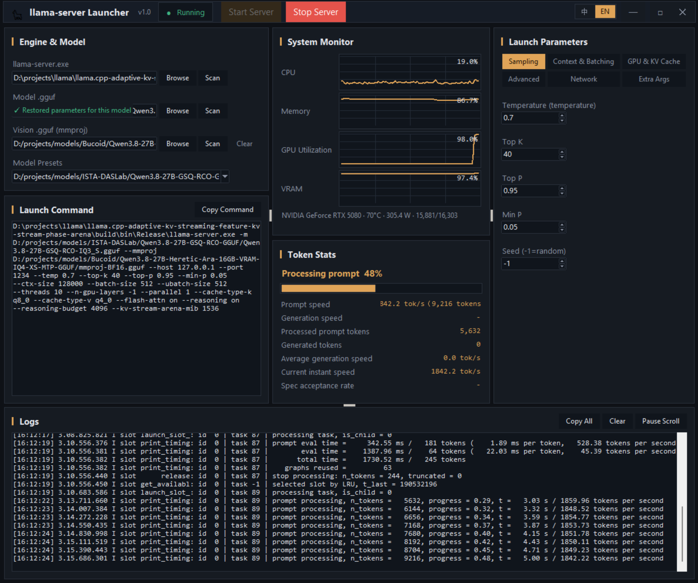

# LlamaLauncher

A standalone, single-file Windows desktop GUI for launching and monitoring
[llama-server](https://github.com/ggml-org/llama.cpp) — no browser or web server required.



## Features

- **Engine & model** — pick `llama-server.exe` and a `.gguf` model (plus an
  optional `.mmproj` vision model); presets are persisted in `settings.json`.
- **Launch & stop** — start/stop the server with a full, editable argument list
  (context, GPU layers, threads, batch size, …) and free-form extra arguments.
- **System monitor** — live CPU / memory / GPU-utilization / VRAM sparklines and
  server status polled from the running server.
- **Token stats & log** — prompt/generation speed, token counts, and a
  color-coded server log.

## Build requirements

- Windows 10/11 (x64)
- Python 3.10+ with `tkinter`
- [PyInstaller](https://pyinstaller.org/) 6+

## Build

From this folder:

```bat
python build_exe.py
```

or manually:

```bat
python -m pip install -r requirements.txt
python -m PyInstaller launcher.spec --clean --noconfirm
```

The single-file executable is written to `dist\LlamaLauncher.exe`.
Double-click to run; a `settings.json` is created next to the exe on first start.

## Files

| File | Purpose |
| --- | --- |
| `native_gui.py` | the tkinter GUI (entry point) |
| `core.py` | shared backend: process lifecycle, settings, GPU/monitor, arg builder |
| `launcher.spec` | PyInstaller spec (one-file, windowed) |
| `build_exe.py` | one-click build script |
| `requirements.txt` | runtime + build dependencies |
